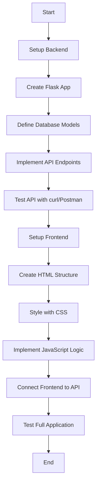

# Todo Application - Project Plan

## Overview
A simple single-user todo application with Python Flask backend, SQLite database, and vanilla JavaScript frontend.

---

## 1. Project Directory Structure

```
todo-app/
├── backend/
│   ├── app.py                 # Main Flask application
│   ├── models.py              # Database models
│   ├── config.py              # Configuration settings
│   ├── requirements.txt       # Python dependencies
│   ├── database.db            # SQLite database (auto-generated)
│   └── tests/
│       └── test_api.py        # API tests
├── frontend/
│   ├── index.html             # Main HTML page
│   ├── css/
│   │   └── styles.css         # Application styles
│   └── js/
│       ├── app.js             # Main application logic
│       └── api.js             # API communication layer
├── README.md                  # Project documentation
└── .gitignore                 # Git ignore file
```

---

## 2. Database Schema

### Table: `todos`

| Column | Type | Constraints | Description |
|--------|------|-------------|-------------|
| id | INTEGER | PRIMARY KEY, AUTOINCREMENT | Unique identifier |
| title | TEXT | NOT NULL | Todo title/description |
| completed | BOOLEAN | NOT NULL, DEFAULT 0 | Completion status |
| created_at | TIMESTAMP | DEFAULT CURRENT_TIMESTAMP | Creation timestamp |
| updated_at | TIMESTAMP | DEFAULT CURRENT_TIMESTAMP | Last update timestamp |

### SQL Schema
```sql
CREATE TABLE todos (
    id INTEGER PRIMARY KEY AUTOINCREMENT,
    title TEXT NOT NULL,
    completed BOOLEAN NOT NULL DEFAULT 0,
    created_at TIMESTAMP DEFAULT CURRENT_TIMESTAMP,
    updated_at TIMESTAMP DEFAULT CURRENT_TIMESTAMP
);
```

---

## 3. API Endpoints

### Base URL: `http://localhost:5000/api`

| Method | Endpoint | Description | Request Body | Response |
|--------|----------|-------------|--------------|----------|
| GET | `/todos` | Get all todos | None | `[{id, title, completed, created_at, updated_at}]` |
| GET | `/todos/<id>` | Get specific todo | None | `{id, title, completed, created_at, updated_at}` |
| POST | `/todos` | Create new todo | `{title: string}` | `{id, title, completed, created_at, updated_at}` |
| PUT | `/todos/<id>` | Update todo | `{title?: string, completed?: boolean}` | `{id, title, completed, created_at, updated_at}` |
| DELETE | `/todos/<id>` | Delete todo | None | `{message: "Todo deleted"}` |

### API Response Format

**Success Response:**
```json
{
  "success": true,
  "data": { ... }
}
```

**Error Response:**
```json
{
  "success": false,
  "error": "Error message"
}
```

---

## 4. Technology Stack

### Backend
- **Python 3.8+**: Programming language
- **Flask 3.0+**: Web framework
- **Flask-CORS**: Handle Cross-Origin Resource Sharing
- **SQLite3**: Database (built-in with Python)

### Frontend
- **HTML5**: Structure
- **CSS3**: Styling
- **Vanilla JavaScript (ES6+)**: Logic and interactivity
- **Fetch API**: HTTP requests to backend

### Development Tools
- **pip**: Python package manager
- **venv**: Virtual environment
- **pytest**: Testing framework (optional)

---

## 5. Key Features

### Core Functionality
- ✅ Create new todos
- ✅ View all todos
- ✅ Mark todos as complete/incomplete
- ✅ Edit todo titles
- ✅ Delete todos
- ✅ Persist data in SQLite database

### User Interface
- Clean, responsive design
- Real-time updates without page refresh
- Visual feedback for completed todos
- Input validation
- Error handling and user notifications

---

## 6. Implementation Workflow



---

## 7. Backend Dependencies

**requirements.txt:**
```
Flask==3.0.0
Flask-CORS==4.0.0
```

---

## 8. API Implementation Details

### Flask App Structure
```python
# app.py structure
- Initialize Flask app
- Configure CORS
- Initialize SQLite database
- Define routes for CRUD operations
- Error handling middleware
- Run development server
```

### Database Operations
- Use SQLite3 with context managers
- Implement helper functions for CRUD
- Handle database connections properly
- Add timestamp updates on modifications

---

## 9. Frontend Implementation Details

### HTML Structure
- Header with app title
- Input form for new todos
- Todo list container
- Individual todo items with:
  - Checkbox for completion
  - Title text
  - Edit button
  - Delete button

### JavaScript Architecture
- **api.js**: API communication functions
  - `fetchTodos()`
  - `createTodo(title)`
  - `updateTodo(id, data)`
  - `deleteTodo(id)`
  
- **app.js**: Application logic
  - DOM manipulation
  - Event handlers
  - State management
  - UI updates

### CSS Styling
- Modern, clean design
- Responsive layout
- Hover effects
- Completed todo styling (strikethrough)
- Button styles
- Form styling

---

## 10. Testing Strategy

### Backend Testing
- Test each API endpoint
- Validate request/response formats
- Test error handling
- Database operations testing

### Frontend Testing
- Manual testing in browser
- Test all CRUD operations
- Verify UI updates
- Test error scenarios

---

## 11. Development Steps

1. **Backend Setup**
   - Create virtual environment
   - Install dependencies
   - Create database schema
   - Implement Flask routes
   - Test API endpoints

2. **Frontend Setup**
   - Create HTML structure
   - Add CSS styling
   - Implement JavaScript logic
   - Connect to backend API
   - Test user interactions

3. **Integration Testing**
   - Test complete workflow
   - Fix any bugs
   - Optimize performance

4. **Documentation**
   - Add code comments
   - Create README with setup instructions
   - Document API usage

---

## 12. Running the Application

### Backend
```bash
cd backend
python -m venv venv
source venv/bin/activate  # On Windows: venv\Scripts\activate
pip install -r requirements.txt
python app.py
```

### Frontend
```bash
# Simply open frontend/index.html in a browser
# Or use a simple HTTP server:
cd frontend
python -m http.server 8000
```

---

## 13. Future Enhancements (Optional)

- Add todo categories/tags
- Implement due dates
- Add priority levels
- Search and filter functionality
- User authentication
- Data export/import
- Dark mode toggle
- Drag-and-drop reordering

---

## Summary

This plan provides a complete blueprint for building a simple, functional todo application. The architecture is straightforward, making it easy to implement and maintain. The separation of backend and frontend allows for independent development and testing of each component.